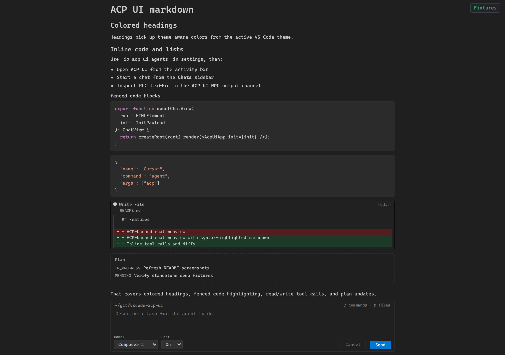
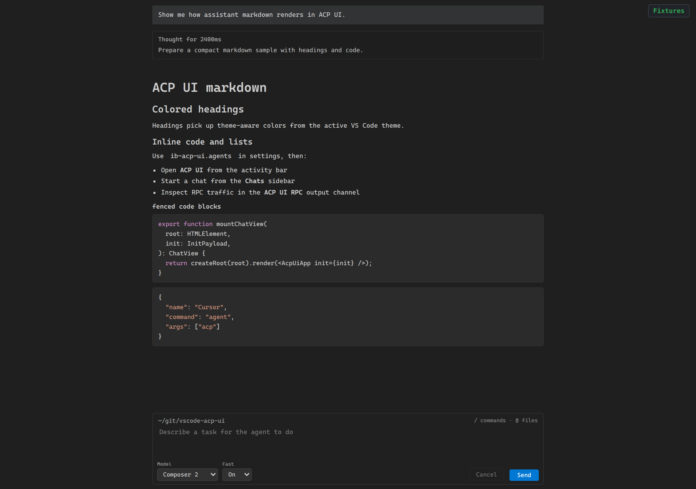
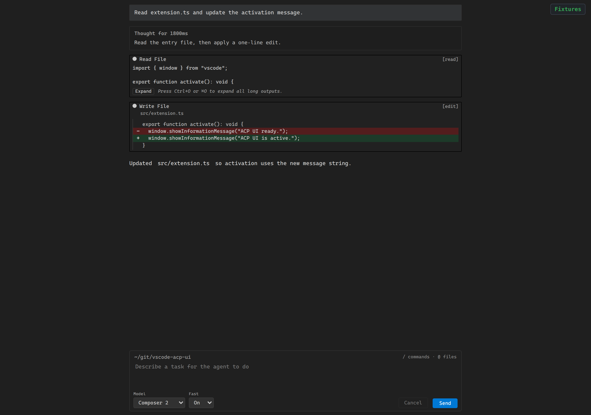
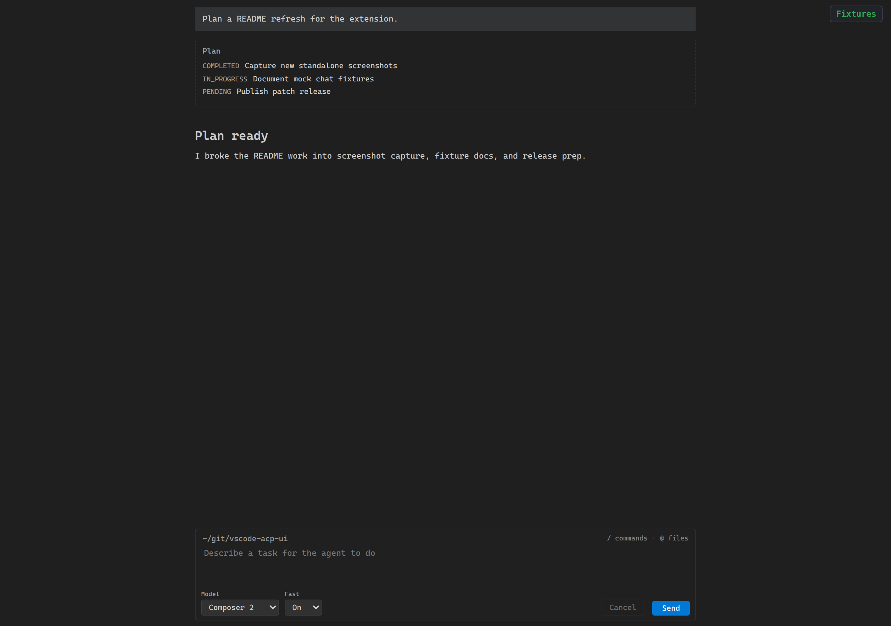
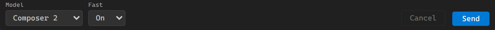
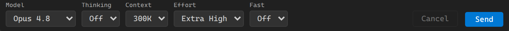

# ACP UI

VS Code extension that brings an **ACP UI** panel to the [Agent Client Protocol (ACP)](https://github.com/agentclientprotocol) — chat with configured agent processes from the editor.

Open **ACP UI** from the activity bar to get a dedicated chat surface next to your code: the **Chats** view lists sessions, and the webview shows the running conversation with the same UI in an editor tab or side panel.



*Streaming markdown, tool calls, thoughts, and plans in the ACP UI trace.*

## Features

- **ACP UI** webview: ACP-backed chat in an editor tab or panel.
  Theme-aware markdown with colored headings and syntax-highlighted fenced code:

  

- **Tool calls** inline in the trace: read output, terminal runs, and file diffs:

  

- **Agent plans** rendered as structured plan blocks:

  

- **Chats** sidebar under the **ACP UI** activity bar: list sessions, open, refresh, delete.
- **Session config** in the composer when the agent advertises model and tuning options.
  Cursor-style bracketed models show a family picker plus derived params (for example **Fast**):

  

  Agents that advertise explicit `model_config` options use a Zed-style toolbar (model, thinking, context, effort, and more):

  

- **ACP UI RPC** output channel for debugging protocol traffic.
- **Agent configuration** via `ib-acp-ui.agents` in settings (command, args, env per agent).

## Requirements

- VS Code `1.115.0` or newer.
- At least one ACP-capable agent CLI available on your `PATH` (for example `agent`, `gemini`, or another ACP-compatible command).
- Any auth/environment variables required by your chosen agent.

## Quick Start

1. Install the extension.
2. Open **ACP UI** from the activity bar.
3. Start a chat with **Open ACP UI** or **New ACP UI in Editor**.
4. Pick an agent from the chat header (or configure agents in settings first).

## Usage

### Configure Agents

Set `ib-acp-ui.agents` in settings. Each entry defines one launchable ACP agent process.

```json
"ib-acp-ui.agents": [
  {
    "name": "Cursor",
    "command": "agent",
    "args": ["acp"]
  },
  {
    "name": "Gemini",
    "command": "gemini",
    "args": ["--acp"],
    "env": {
      "GEMINI_API_KEY": "${env:GEMINI_API_KEY}"
    }
  }
]
```

Fields:
- `name`: label shown in ACP UI.
- `command`: executable to spawn.
- `args`: optional argument list.
- `env`: optional per-agent environment variables.

### Common Actions

- Open chat: `Open ACP UI`
- Create chat in editor: `New ACP UI in Editor`
- Focus session list: `Focus ACP UI Chats list`
- Rename/delete sessions from the **Chats** view context actions
- Inspect protocol traffic: `Show ACP RPC Log`
- Use composer slash commands from [`BUILTIN_COMMANDS.md`](BUILTIN_COMMANDS.md)

## Development

```bash
npm ci
npm run build      # webview + extension bundle
npm run watch      # extension esbuild watch (run build:webview first or after UI changes)
npm run check      # TypeScript
npm run test       # vitest
npm run verify     # build + check + test + lint
```

For a browser-only UI loop without VS Code, use `npm run dev:standalone` (see `standalone/`).
Preview mock chats without a live agent:

```bash
npm run dev:standalone:demo
```

Then open http://localhost:5173.
Browse mock chats and model-picker seeds from http://localhost:5173/fixtures.
The standalone shell loads workbench colors and markdown syntax from your VS Code user settings (`~/.config/Code/User/settings.json` by default).
Override with `ACP_UI_VSCODE_SETTINGS=/path/to/settings.json` if needed.
In demo mode, send `fixture-markdown`, `fixture-tools`, or `fixture-plan` in the composer to replay other samples.
Set `ACP_UI_DEMO_SEED=opus-model` to preview the agent-ordered model toolbar.

Regenerate fixtures and README screenshots:

```bash
npm run screenshots
```

Publishing is automated when `package.json` **version** changes on `main` (see `.github/workflows/publish.yml`).

## Troubleshooting

- No responses in chat: verify your selected agent command runs in a shell and supports ACP mode.
- Agent missing in picker: confirm `ib-acp-ui.agents` JSON is valid and reload the VS Code window.
- Need diagnostics: open the `ACP UI RPC` output channel and retry the action.

## Explore

| Area | Role |
| --- | --- |
| [`src/extension.ts`](src/extension.ts) | Extension entry: activates ACP services, ACP UI panel, Chats tree view. |
| [`src/extension/`](src/extension/) | Chat webview registration, sessions sidebar, agent picker, prompt history. |
| [`src/acp/`](src/acp/) | ACP session bridge, agent config from VS Code settings, RPC helpers. |
| [`src/protocol/`](src/protocol/) | Messages between extension host and webview. |
| [`webview/acp-ui/`](webview/acp-ui/) | React + Vite webview UI (chat UI, markdown, state). |
| [`standalone/`](standalone/) | Local dev server and mocks for the webview without the extension host. |
| [`standalone/fixtures/chats/`](standalone/fixtures/chats/) | Committed mock chat replays for demo and screenshots. |
| [`specs/`](specs/) | Design notes for features and commands. |
| [`media/`](media/) | Activity bar and view icons. |

Mock chat fixtures are built by `scripts/build-showcase-fixtures.ts` and replayed through the standalone WebSocket bridge.

## License

MIT — see [`package.json`](package.json) `license` field.
